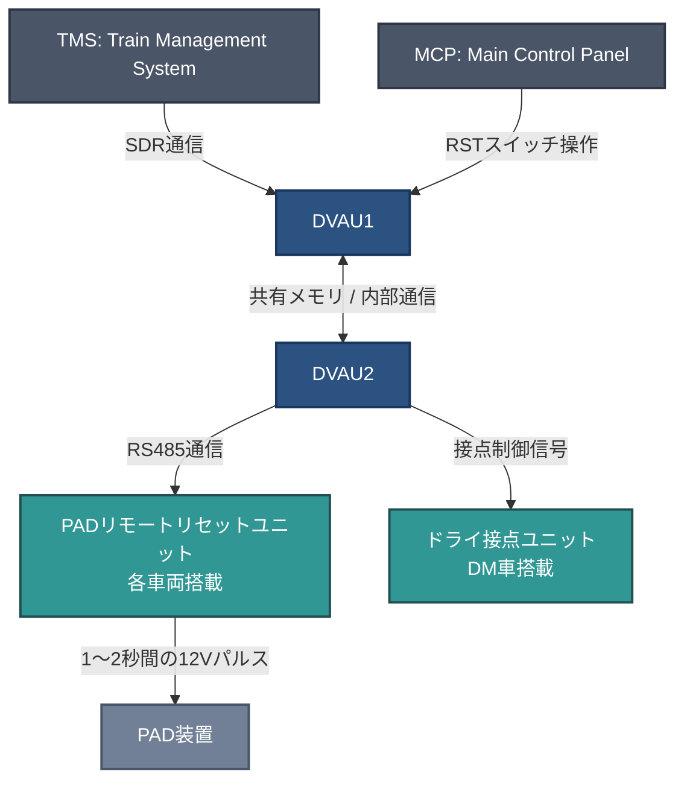
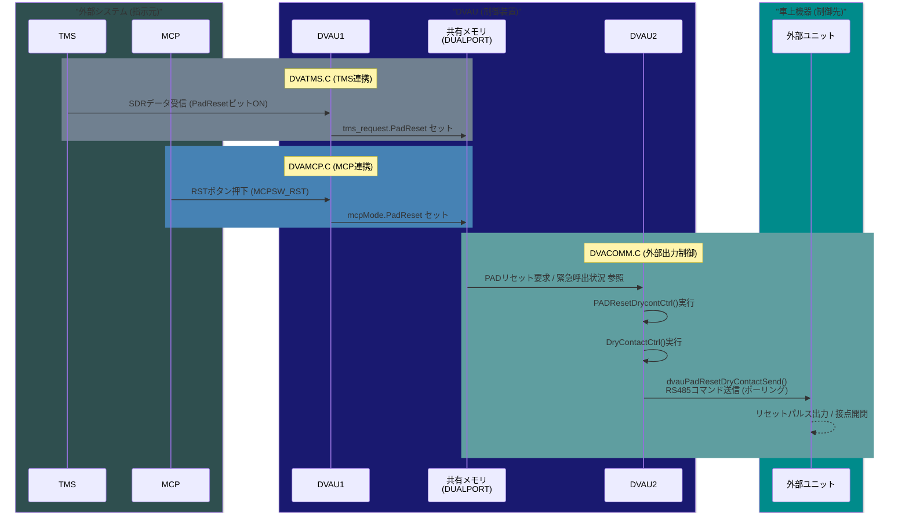
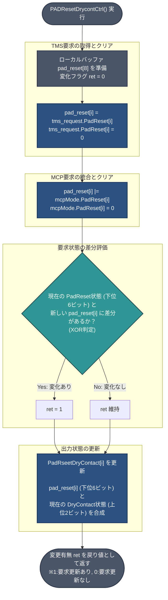
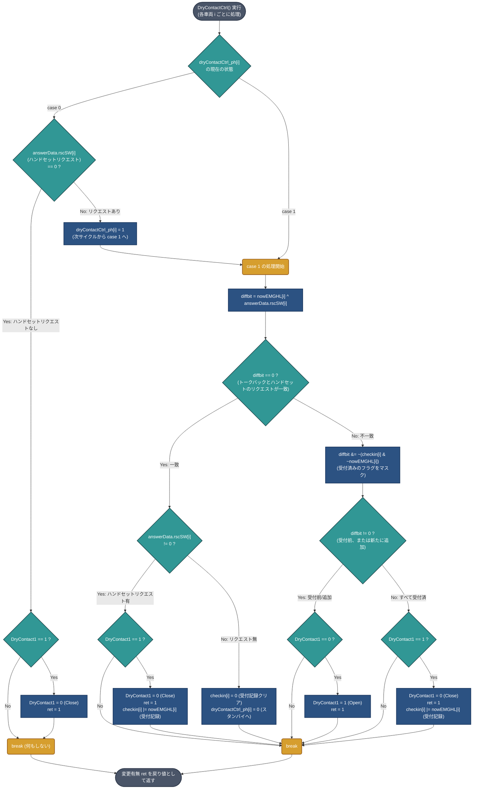

# PADリモートリセット機能 外部仕様書

**ソフトウェア管理番号:** TVHS6098 (Rev.6_1)  
**作成者:** [Your Name / Company]

---

## 1. 概要

香港地下鉄向けDVAUにおいて、TMS（Train Management System）およびMCP（Main Control Panel）から送信される「PAD（Passenger Alarm Device）リセット指示」を受け取り、各車両の「PADリモートリセットユニット」および「ドライ接点ユニット」を遠隔で制御する「PADリモートリセット機能」を新規実装する。

> 対象機器: DVAU1, DVAU2

---

## 2. 構成

### 2.1 ハードウェア構成



- TMS (Train Management System)
- MCP (Main Control Panel)
- DVAU1 (TMS, MCPとの通信処理)
- DVAU2 (ドライ接点・PADリモートリセットユニットへの制御出力)
- PADリモートリセットユニット（各車両搭載）
- ドライ接点ユニット（DM車搭載）

### 2.2 ソフトウェア構成



- `MTRC/COMMINC/TABLE.H`: 共有データ構造体、制御フラグの定義
- `MTRC/DVAU1/SRC/DVATMS.C`: TMS連携モジュール（SDRデータからのリセット要求検出）
- `MTRC/DVAU1/SRC/DVAMCP.C`: MCP連携モジュール（RSTスイッチ操作検出）
- `MTRC/DVAU2/SRC/DVACOMM.C`: 通信・出力制御モジュール（RS485経由でのユニット制御）

---

## 3. 機能

### 3.1 機能説明

#### 3.1.1 TMS ↔ DVAU 間の制御モジュール (DVAU1)
TMSから送信されるSDRデータに含まれる「PADリセット選択ビット」を監視し、リセット要求（立ち上がりエッジ）を検出した場合、システム内のリセット要求フラグをセットする。

#### 3.1.2 MCP操作による制御モジュール (DVAU1)
乗務員が対象のPADを通話状態にした後、MCP上の「RST」ボタンを押下したことを検出し、選択中のPADに対するリセット要求フラグをセットする。

#### 3.1.3 追加ドライ接点ユニットおよびPADリモートリセットユニットへの出力制御モジュール (DVAU2)
TMSおよびMCPからのリセット要求を受け、各車両向けのPADリモートリセット装置へリセットトリガーを送信し、またDM車のドライ接点ユニットへ制御信号（オープン/クローズ）を送信する。

---

## 4. プログラム・インターフェース

### 4.1 共有メモリ空間定義 (`TABLE.H`)

以下の制御フラグが `DUALPORT` および関連構造体へ追加されている。

| 変数名 | データ構造 | 説明 |
|--------|-----------|------|
| `SDR.PadReset[8]` | `unsigned char` | TMSからのSDR受信データ内 PADリセットフラグ |
| `tms_request.PadReset[8]` | `unsigned char` | TMSからのPADリセット要求保持フラグ |
| `mcpMode.PadReset[16]` | `unsigned char` | MCPからのPADリセット要求保持フラグ |
| `PadRseetDryContact[16].BIT.DryContact1` | `unsigned char :1` | ドライ接点1 制御ビット |
| `PadRseetDryContact[16].BIT.DryContact2` | `unsigned char :1` | ドライ接点2 制御ビット |
| `PadRseetDryContact[16].BIT.PadReset1〜6` | `unsigned char :1` | 各車両 PADリセット1〜6 制御ビット |

### 4.2 TMS制御仕様 (`DVATMS.C`)

- TMSから受信したSDRデータ内の `PadReset` ビットの立ち上がりエッジ（OFF→ON）を検出する。
- 検出後、共有メモリ `DUALPORT.tms_request.PadReset` の該当ビットをONにセットする。

### 4.3 MCP制御仕様 (`DVAMCP.C`)

- 運用中、乗務員操作によるMCPからのスイッチ情報 `acceptSW` が `MCPSW_RST` (リセットボタン) となった場合を検知する。
- 現在選択中の緊急呼出状況 `EMGPHL` を元に、`DUALPORT.mcpMode.PadReset` へ対象のPAD情報をセットし、リセットトリガーを発行する。

### 4.4 出力制御・外部ユニット通信仕様 (`DVACOMM.C`)

#### 4.4.1 PADリセット制御 (`PADResetDrycontCtrl()`)
- `tms_request.PadReset` (TMS) および `mcpMode.PadReset` (MCP) のリセット要求を統合・評価する。
- 要求がある場合、該当車両の `PadRseetDryContact.BIT.PadReset1〜6` をセットする。



#### 4.4.2 ドライ接点制御 (`DryContactCtrl()`)
- 緊急呼出（PAEH）の発生状況と通話状態に応じて、ドライ接点（`DryContact1`）のオープン(1)/クローズ(0)を制御する。
- `dryContactCtrl_ph[i]` によるステートマシンで、通常状態と緊急呼出状態を遷移しながら管理する。
> ※ ハードウェア上のノーマリークローズ(NC)動作として、0=NC(通常時/Close), 1=Open(起動時) を前提とする。



#### 4.4.3 外部ユニットへのコマンド送信
- 上記制御処理により状態が変更された場合、RS485 トレイン通信ラインのポーリング処理 (`dvauPadResetDryContactSend()`) を経由して、各ユニットへコマンドを送信する。

---

## 5. 今後の作業申し送り・懸念事項

1. **動作タイミングの検証**:
   PAEH起動の確認からリモートリセットまでに通信サイクル上のタイムラグが生じる可能性があるため、実機（またはシミュレータ）でのディレイが許容範囲内か確認が必要。

   ```mermaid
   sequenceDiagram
       participant PAD as PAD装置<br>(乗客操作)
       participant Ext as 外部ユニット<br>(接点 / リセット)
       participant DVAU2 as DVAU2<br>(外部出力・RS485)
       participant DP as 共有メモリ<br>(DUALPORT)
       participant DVAU1 as DVAU1<br>(TMS/MCP通信)
       participant Host as TMS / MCP<br>(指示元)

       %% --- PAEH 発生 ---
       rect rgba(200, 50, 50, 0.1)
       Note over PAD,Host: [1] 緊急呼出(PAEH) 発生とドライ接点の起動
       PAD->>Ext: PAD作動 (通話要求)
       Ext-->>DVAU2: ポーリングにより状態収集
       DVAU2->>DP: rscSW / nowEMGHL 更新
       DP->>DVAU1: 状態共有
       DVAU1->>Host: 状態通知 (TMS/MCPのUI更新)
       
       Note right of DVAU2: 次の内部処理サイクル<br>DryContactCtrl()実行
       DVAU2->>DVAU2: DryContact1 = 1 (Open) 設定
       DVAU2->>Ext: RS485 コマンド送信<br>(ドライ接点 Open)
       end

       %% --- PAD リセット ---
       rect rgba(50, 50, 200, 0.1)
       Note over PAD,Host: [2] 乗務員による PADリモートリセット操作
       Host->>DVAU1: リセット指示 (SDR通信 / MCPボタン)
       DVAU1->>DP: tms_request / mcpMode の PadReset セット
       
       Note right of DVAU2: 次の内部処理サイクル<br>PADResetDrycontCtrl()実行
       DP->>DVAU2: PadReset要求 取得
       DVAU2->>DVAU2: 統合・評価 (ret = 1)
       DVAU2->>Ext: RS485 コマンド送信<br>(PADリセット パルス指示)
       Ext->>PAD: 1〜2秒間の12Vパルス出力
       PAD-->>Ext: PAD復旧
       end
       
       %% --- 懸念事項のハイライト ---
       Note over Ext,Host: ⚠️ 懸念点: 通信ポーリング周期・内部処理サイクルによる<br>「状態反映までの遅延 (Delay)」や「RS485送信頻度」の実機検証が必要。
   ```
2. **外部ユニットハードウェア側の仕様確認**:
   PADリモートリセット装置からの「1〜2秒間の12Vパルス出力」は受端機器（外部ユニット）のハードウェア実装となるため、DVAU側コマンド受領後に正常にパルスが生成されるか実機検証が必要。
3. **ドライ接点のNC/NO状態確認**:
   仕様書上の通常時=Close(0)、起動時=Open(1) のロジックと、実機（ソリッドステートリレー等）の電気的特性が合致しているか、試験時に確認すること。

4. **物理的復旧と上位システム反映間の競合（再作動の取りこぼしリスク）**:
   リセットパルス（1〜2秒）の出力によって物理的なPADが復旧（OFF）した後、その状態変化がポーリング通信によってDVAUへ伝達され、さらに上位（TMS/MCP）へ「復旧」として認識されるまでには通信上のタイムラグが存在する。
   もしこの状態反映が完了する前に、乗客が再度同じPADを物理的に作動（ON）させた場合、DVAUはOFFへの状態変化（エッジ）を捕捉できず、システム上は「リセット指示が効かずにONのままであった」と見なされる可能性がある。
   - **運用面でのカバー**: 乗務員が画面上で未復旧と判断し、再度リセット指示を行うことで現場対応は可能。
   - **インシデント管理上の制約**: 「一度リセットされた直後に再操作された」という事実がシステムログ（TMS等）に記録されない可能性があるため、この非同期システム特有の仕様上の制約について、上位システム側と認識を合わせておく必要がある。